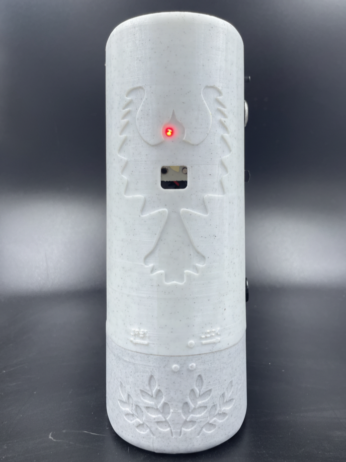
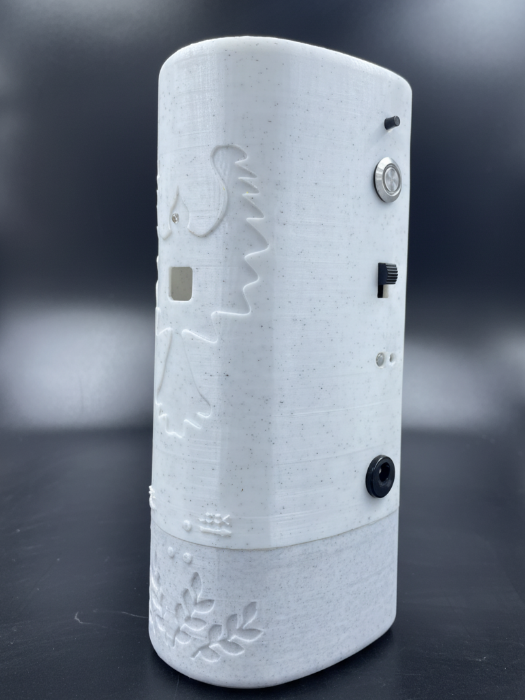

# VeraShield nRF52 Firmware

- [VeraShield nRF52 Firmware](#verashield-nrf52-firmware)
  - [Product photos](#product-photos)
  - [What this firmware does](#what-this-firmware-does)
  - [Key technical points](#key-technical-points)
  - [Prototype](#prototype)

Firmware for a small, battery-powered spray device built on Nordic nRF52.  
C firmware using nRF Connect SDK, with hardware drivers, ADC-based sensing, scheduling, and a custom BLE control layer.

**Companion app:** 👉 [BLE control app repo](https://github.com/Kushal-Chandar/Verashield-App)

## Product photos

<table>
  <tr>
    <td align="center">
      <strong>Front view</strong> 
      
    </td>
    <td align="center">
      <strong>Side view</strong> 
      
    </td>
  </tr>
</table>

Short demo clips:
  

https://github.com/user-attachments/assets/becf35ab-b74b-4b60-8dcc-868941870102

https://github.com/user-attachments/assets/b98b5b6c-cf41-4e73-ad2d-16e138836947

## What this firmware does

- Runs **scheduled spray cycles** using an **MCP7940 RTC**
- Lets a **mobile app trigger spray remotely** over BLE
- Drives a **servo** via PWM for the spray mechanism
- Reads **battery voltage** and **slider position** via ADC (SAADC channels)
- Tracks **usage statistics** and drives **status LEDs** for feedback

## Key technical points

**Platform & tools**

- Nordic **nRF52 (nRF52832-class)**, C, nRF Connect SDK, VS Code + nRF Connect extensions  
- Zephyr-style config: device tree overlay + `prj.conf`, CMake build (handled by the SDK tools)

**Peripherals**

- **ADC:**  
  - `VBAT` and `SLIDER` wired to SAADC channels (12-bit, internal reference, per-channel gain)  
  - Used for battery monitoring and user slider input
- **PWM / servo:**  
  - `pwm-servo` node on `pwm1`, 20 ms period, 600–2400 µs pulse range for spray actuation
- **I²C:**  
  - **MCP7940 RTC** for timekeeping and schedule timing  
  - **AT24C32 EEPROM** for persistent data
- **SPI & GPIO:**  
  - `spi1` enabled for external hardware (e.g. LED / TLC driver)  
  - Button alias and LEDs for local input/indication

**BLE GATT design**

Custom service for app control:

- **Time sync characteristic**  
  - App sends a compact 7-byte timestamp; firmware updates MCP7940 and re-arms the schedule.

- **Scheduling characteristic**  
  - Read: current schedule entries (time + intensity).  
  - Write: app replaces the full schedule; firmware validates all entries and updates the internal queue.

- **Statistics characteristic**  
  - Windowed read (start index + window size) over historical spray events.

- **Remote spray characteristic**  
  - 1-byte command to trigger / change spray state in real time.

Implementation is **MTU-aware**, uses **offset-based reads**, and validates all payloads before applying changes.

## Prototype

  <strong>Development prototype</strong> 
  

The prototype was used to bring up RTC, ADC, servo, and BLE, and to tune the spray cycle, statistics logging, and app interaction.
